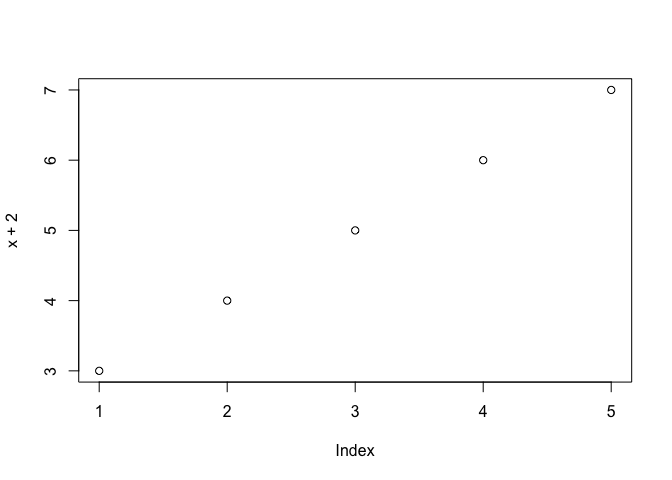
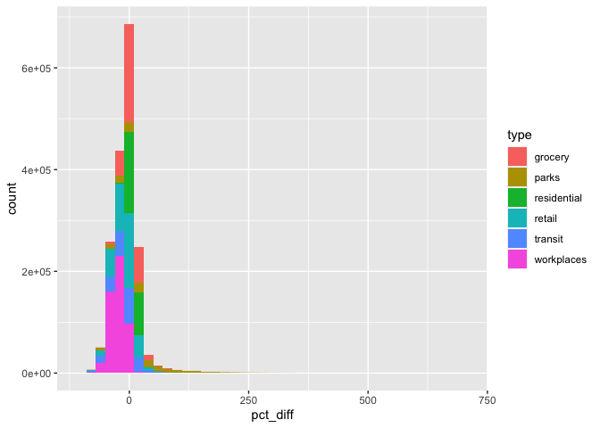
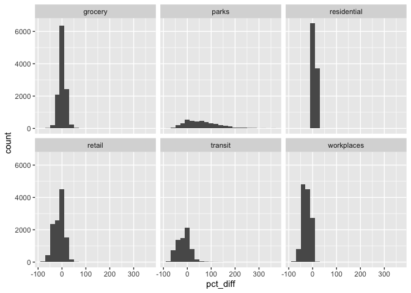
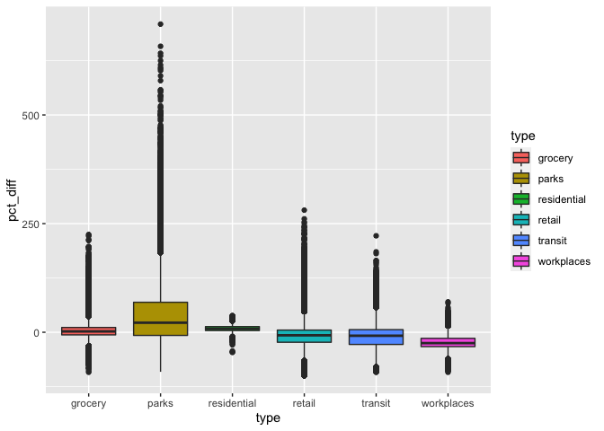
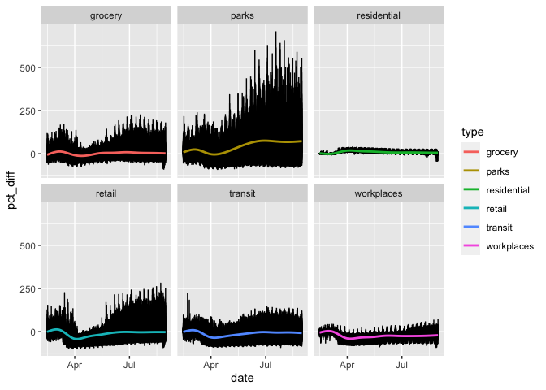
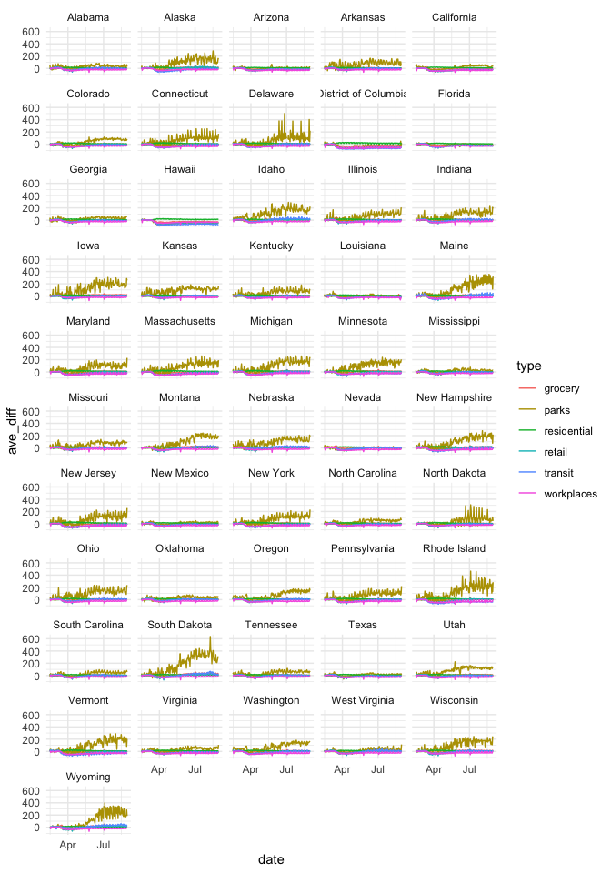

# Methods 522 
## R Lab: September 17, 2020 

*This assignment provides an introduction to data analysis in R using the tidyverse package. The objectives of this lab are to: 
1. Understand Categorical and Continuous Data
2. Learn and practice the basics of data analysis

The lab includes several questions for you to answer as well as several code snippets to replicate. If you are new to R and/or programming in general, I urge you to type out each line of code, rather than using copy and paste. For additional help, reach out the #r channel on slack.

***

### Getting ready

Download this file as markdown file (.Rmd) and open in Rstudio. It's going to look a little differently than in the browser! Markdown files let you incorporate both code and text. You can run and manipulate the code included in this document, which you will need to do in order to complete this assignment. Basically, markdown files combine the script and output windows into one file! 

Here's a "cheatsheet" for formatting R Markdown that might be helpful as you make your own markdown files: https://rstudio.com/wp-content/uploads/2015/02/rmarkdown-cheatsheet.pdf

This is what a code section looks like: 

```r
# when you use the "#" it's a text comment -- ie not code that will run. This is useful when
# annotating your code. 

# now try running these lines of code:  
2+2 
```

```
## [1] 4
```

```r
x<- c(1:5)
plot(x+2)
```

<!-- -->


For this tutorial (and most analysis you will do in r) we need the tidyverse package. Some of you may have already installed this so we just need to open it. We also need to import the data we'll be using, in this case, the covdata package from Kieran Healy (https://kjhealy.github.io/covdata/). A lot of data sets are included in this one package. Visit the codebook to see summaries of them all. https://kjhealy.github.io/covdata/articles/codebook.html


```r
# if you have not installed tidyverse, make sure to do so: 
# install.packages("tidyverse)
library(tidyverse)
```

```
## ── Attaching packages ──────────────────────────────────────────────────────────────── tidyverse 1.3.0 ──
```

```
## ✓ ggplot2 3.3.2     ✓ purrr   0.3.4
## ✓ tibble  3.0.3     ✓ dplyr   1.0.2
## ✓ tidyr   1.1.2     ✓ stringr 1.4.0
## ✓ readr   1.3.1     ✓ forcats 0.5.0
```

```
## ── Conflicts ─────────────────────────────────────────────────────────────────── tidyverse_conflicts() ──
## x dplyr::filter() masks stats::filter()
## x dplyr::lag()    masks stats::lag()
```

```r
# we'll install the data set directly from github. 
devtools::install_github("kjhealy/covdata")
```

```
## Skipping install of 'covdata' from a github remote, the SHA1 (f3112f6d) has not changed since last install.
##   Use `force = TRUE` to force installation
```

```r
library(covdata)
```

```
## 
## Attaching package: 'covdata'
```

```
## The following object is masked from 'package:datasets':
## 
##     uspop
```

*** 

### Reviewing data

We'll examine the google_mobility dataset, which notes daily aggregate changes in visits to different types of locations -- letting us examine how COVID impacts mobility. The pct_diff variable indicates a increase or decrease from a baseline average caclucated from a week prior to the pandemic. 

First, let's get a sense of the data: 


```r
head(google_mobility, n=10) # Take a look at the first 10 observations. What do you think we would do to look at only the top 5? 
```

```
## # A tibble: 10 x 10
##    country_region_… country_region sub_region_1 sub_region_2 metro_area
##    <chr>            <chr>          <chr>        <chr>        <chr>     
##  1 AE               United Arab E… <NA>         <NA>         <NA>      
##  2 AE               United Arab E… <NA>         <NA>         <NA>      
##  3 AE               United Arab E… <NA>         <NA>         <NA>      
##  4 AE               United Arab E… <NA>         <NA>         <NA>      
##  5 AE               United Arab E… <NA>         <NA>         <NA>      
##  6 AE               United Arab E… <NA>         <NA>         <NA>      
##  7 AE               United Arab E… <NA>         <NA>         <NA>      
##  8 AE               United Arab E… <NA>         <NA>         <NA>      
##  9 AE               United Arab E… <NA>         <NA>         <NA>      
## 10 AE               United Arab E… <NA>         <NA>         <NA>      
## # … with 5 more variables: iso3166_2 <chr>, census_fips_code <chr>,
## #   date <date>, type <chr>, pct_diff <int>
```

```r
str(google_mobility) # Find a description of each variable 
```

```
## tibble [13,752,552 × 10] (S3: tbl_df/tbl/data.frame)
##  $ country_region_code: chr [1:13752552] "AE" "AE" "AE" "AE" ...
##  $ country_region     : chr [1:13752552] "United Arab Emirates" "United Arab Emirates" "United Arab Emirates" "United Arab Emirates" ...
##  $ sub_region_1       : chr [1:13752552] NA NA NA NA ...
##  $ sub_region_2       : chr [1:13752552] NA NA NA NA ...
##  $ metro_area         : chr [1:13752552] NA NA NA NA ...
##  $ iso3166_2          : chr [1:13752552] NA NA NA NA ...
##  $ census_fips_code   : chr [1:13752552] NA NA NA NA ...
##  $ date               : Date[1:13752552], format: "2020-02-15" "2020-02-15" ...
##  $ type               : chr [1:13752552] "retail" "grocery" "parks" "transit" ...
##  $ pct_diff           : int [1:13752552] 0 4 5 0 2 1 1 4 4 1 ...
```

```r
summary(google_mobility) # Another description of each variable 
```

```
##  country_region_code country_region     sub_region_1       sub_region_2      
##  Length:13752552     Length:13752552    Length:13752552    Length:13752552   
##  Class :character    Class :character   Class :character   Class :character  
##  Mode  :character    Mode  :character   Mode  :character   Mode  :character  
##                                                                              
##                                                                              
##                                                                              
##                                                                              
##   metro_area         iso3166_2         census_fips_code        date           
##  Length:13752552    Length:13752552    Length:13752552    Min.   :2020-02-15  
##  Class :character   Class :character   Class :character   1st Qu.:2020-04-06  
##  Mode  :character   Mode  :character   Mode  :character   Median :2020-05-27  
##                                                           Mean   :2020-05-25  
##                                                           3rd Qu.:2020-07-14  
##                                                           Max.   :2020-08-30  
##                                                                               
##      type              pct_diff      
##  Length:13752552    Min.   :-100     
##  Class :character   1st Qu.: -35     
##  Mode  :character   Median : -11     
##                     Mean   : -14     
##                     3rd Qu.:   5     
##                     Max.   :1206     
##                     NA's   :5094724
```
We can also view the full thing by running view(google_mobility) - but it's very large, so it's often easier to run these summary "looks". 

Some notes about the data: 

 - The accuracy and understanding of the place categories (type) do vary by region, so we should be hesitant with any firm conclusions that compare countries or urban and rural regions. 
 - The pct_diff variable measures change from a baseline median value that was caclculated based on data from January 2020 (before much of the world started social distancing). 
 - All data is collected from accounts that opted into sharing their Google location history with Google. There are many ways this might effect the generalizability of the findings.  


**What are the continuous and which are the categorical variables?** 


To get a count of variables and observations, we could count the variables from the summary commands above, but there are commands that do that as well:


```r
ncol(google_mobility) # variables - each variable is a column
```

```
## [1] 10
```

```r
nrow(google_mobility) # observations - each observation is one row 
```

```
## [1] 13752552
```

You should find 10  **variables** for 13752552 **observations**. What are these observations of? In other words, what is our *unit of analysis*?

How many different cities, or metro areas, are included in the data set? How many different categories of type are there?


```r
length(unique(google_mobility$metro_area))
```

```
## [1] 66
```

```r
#How would you alter that function to find the number of categories included in the type variable?

#How many dates does the data set cover?
```
***

### Filtering Data 

Often, you might be concerned only with a specific set of cases from your data set. For example, maybe we just want to look at US cities. We'll need to filter and select the data we want. Let's save it as a new data frame, us_mobility. 


```r
# first we need to identify the country region code for the US. I'm pretty sure that States will be included in the country region so let's try that first. We'll use the str_detect funtion to identify  the word in the country_region column. 

google_mobility %>%
  filter(str_detect(country_region, "States"))
```

```
## # A tibble: 3,144,660 x 10
##    country_region_… country_region sub_region_1 sub_region_2 metro_area
##    <chr>            <chr>          <chr>        <chr>        <chr>     
##  1 US               United States  <NA>         <NA>         <NA>      
##  2 US               United States  <NA>         <NA>         <NA>      
##  3 US               United States  <NA>         <NA>         <NA>      
##  4 US               United States  <NA>         <NA>         <NA>      
##  5 US               United States  <NA>         <NA>         <NA>      
##  6 US               United States  <NA>         <NA>         <NA>      
##  7 US               United States  <NA>         <NA>         <NA>      
##  8 US               United States  <NA>         <NA>         <NA>      
##  9 US               United States  <NA>         <NA>         <NA>      
## 10 US               United States  <NA>         <NA>         <NA>      
## # … with 3,144,650 more rows, and 5 more variables: iso3166_2 <chr>,
## #   census_fips_code <chr>, date <date>, type <chr>, pct_diff <int>
```

```r
# aha there we go! Let's filter so we get a data set of only the US observations. We could use either country_region or country_region_code to do so. 


us_mobility <- google_mobility %>% 
  filter(country_region_code=="US")
  

# Filter the data so the only country included is Thailand. 

# How would you filter the data to only get observations for Brazil and Grocery Store? 

# We can also use filter on continuous variables, subsetting the data by a value. Here we filter the data to see only those pct_diff fewer than -100. 

google_mobility %>%
  filter(pct_diff< (-99))
```

```
## # A tibble: 5,040 x 10
##    country_region_… country_region sub_region_1 sub_region_2 metro_area
##    <chr>            <chr>          <chr>        <chr>        <chr>     
##  1 AG               Antigua and B… Saint John   <NA>         <NA>      
##  2 AR               Argentina      Buenos Aires Comuna 10    <NA>      
##  3 AR               Argentina      Buenos Aires Comuna 10    <NA>      
##  4 AR               Argentina      Buenos Aires Comuna 10    <NA>      
##  5 AR               Argentina      Buenos Aires Comuna 10    <NA>      
##  6 AR               Argentina      Buenos Aires Comuna 10    <NA>      
##  7 AR               Argentina      Buenos Aires Comuna 10    <NA>      
##  8 AR               Argentina      Buenos Aires Comuna 10    <NA>      
##  9 AR               Argentina      Buenos Aires Comuna 10    <NA>      
## 10 AR               Argentina      Buenos Aires Comuna 10    <NA>      
## # … with 5,030 more rows, and 5 more variables: iso3166_2 <chr>,
## #   census_fips_code <chr>, date <date>, type <chr>, pct_diff <int>
```

```r
# Filter the us data to find anything that had more than a 80 pct_diff increase
us_mobility %>%
  filter(pct_diff > 80)
```

```
## # A tibble: 27,788 x 10
##    country_region_… country_region sub_region_1 sub_region_2 metro_area
##    <chr>            <chr>          <chr>        <chr>        <chr>     
##  1 US               United States  <NA>         <NA>         <NA>      
##  2 US               United States  <NA>         <NA>         <NA>      
##  3 US               United States  Alabama      <NA>         <NA>      
##  4 US               United States  Alabama      <NA>         <NA>      
##  5 US               United States  Alabama      <NA>         <NA>      
##  6 US               United States  Alabama      <NA>         <NA>      
##  7 US               United States  Alabama      Baldwin Cou… <NA>      
##  8 US               United States  Alabama      Baldwin Cou… <NA>      
##  9 US               United States  Alabama      Baldwin Cou… <NA>      
## 10 US               United States  Alabama      Baldwin Cou… <NA>      
## # … with 27,778 more rows, and 5 more variables: iso3166_2 <chr>,
## #   census_fips_code <chr>, date <date>, type <chr>, pct_diff <int>
```
***

### Grouping and summarizing data 

Another important skill in data science is the ability to summarize across different groups or subsets of data. We can make subsets using filter, as we did above, and then running analysis on the new dataframe, but if we want to aggregate across different categories, it's best to use the group_by function. 


```r
# Lets find a list of all the metropolitian areas included in our data set and count the number of times each type occurs 

google_mobility %>% 
  group_by(metro_area)%>%
  count(type)
```

```
## # A tibble: 396 x 3
## # Groups:   metro_area [66]
##    metro_area                   type            n
##    <chr>                        <chr>       <int>
##  1 Abbottabad Metropolitan Area grocery       198
##  2 Abbottabad Metropolitan Area parks         198
##  3 Abbottabad Metropolitan Area residential   198
##  4 Abbottabad Metropolitan Area retail        198
##  5 Abbottabad Metropolitan Area transit       198
##  6 Abbottabad Metropolitan Area workplaces    198
##  7 Accra Metropolitan Area      grocery       198
##  8 Accra Metropolitan Area      parks         198
##  9 Accra Metropolitan Area      residential   198
## 10 Accra Metropolitan Area      retail        198
## # … with 386 more rows
```

```r
# Are all 50 states included in our us_mobility data fame ?

# Sub_region_1 is equivalent to state for the US region so first lets rename the variable for clarity.
# then we'll count each state
us_mobility <- us_mobility %>%
  rename(state="sub_region_1")

us_mobility %>%
  count(state)
```

```
## # A tibble: 52 x 2
##    state                    n
##    <chr>                <int>
##  1 Alabama              77352
##  2 Alaska               12312
##  3 Arizona              18756
##  4 Arkansas             77154
##  5 California           66960
##  6 Colorado             54834
##  7 Connecticut          10692
##  8 Delaware              4752
##  9 District of Columbia  1188
## 10 Florida              79416
## # … with 42 more rows
```

```r
# what does the n in the table mean? 

# Now lets use our US dataframe and look at the mean change from the baseline (pct_diff) in each type 

us_mobility %>%
  group_by(type) %>%
  summarize(mean=mean(pct_diff, na.rm=TRUE))
```

```
## `summarise()` ungrouping output (override with `.groups` argument)
```

```
## # A tibble: 6 x 2
##   type          mean
##   <chr>        <dbl>
## 1 grocery       2.86
## 2 parks        38.1 
## 3 residential   8.39
## 4 retail       -9.27
## 5 transit     -10.9 
## 6 workplaces  -23.7
```

```r
# What category had the greatest increase across the US? 
# What category had greatest decrease? 


# Now find the mean and standard deviation [sd()] for each type for each state and assign it to the new variable state_type. 
```
*** 

### Data visualization 

Often the best way to get to know your data is by visualizing it! We'll review some of the basics of the ggplot package here and look at the distributions of the pct_diff variable for each type and state. 


```r
# first let's just plot the distributions of the type categories for our us data with a histogram

ggplot(us_mobility, aes(x=pct_diff, fill=type))+
  geom_histogram(binwidth = 20)
```

```
## Warning: Removed 1375162 rows containing non-finite values (stat_bin).
```

<!-- -->

```r
# That's not a very helpful visualization though. Let's facet the graph and make 6 different graphs. We'll also only look at PA data. 

us_mobility %>%
  filter(state== "Pennsylvania") %>%
  ggplot(us_mobility, mapping= aes(x=pct_diff))+
  geom_histogram(binwidth=20)+
  facet_wrap(~type)
```

```
## Warning: Removed 20699 rows containing non-finite values (stat_bin).
```

<!-- -->

```r
# Still not the most useful. We can also use blox plots to look at the distribution of our data for each type. 

ggplot(us_mobility, aes(x=type, y=pct_diff, fill=type))+
  geom_boxplot()
```

```
## Warning: Removed 1375162 rows containing non-finite values (stat_boxplot).
```

<!-- -->

```r
# Make a box plot for the PA data: 
```


The data records changes over time. Let's visualize this. 


```r
ggplot(us_mobility, aes(x=date, y=pct_diff, group=state))+
  geom_line()+
  geom_smooth(aes(color=type, group=1), se=FALSE)+
  facet_wrap(~type)
```

```
## `geom_smooth()` using method = 'gam' and formula 'y ~ s(x, bs = "cs")'
```

```
## Warning: Removed 1375162 rows containing non-finite values (stat_smooth).
```

<!-- -->

```r
# You can change the look of the graph with various themes. Try +theme_minimal() and +theme_dark. 
# Add a title, caption, and change the axis labels with +labs(x= " " , y= " ", title= " ", subtitle=""). 
```

Let's now look at the average change over time for each state for each type


```r
# first we want to make a new data frame that has an average for each state (& DC)

us_mobility %>%
  filter(state != "NA") %>%
  group_by(state, type, date) %>%
  summarise(ave_diff= mean(pct_diff, na.rm=TRUE))%>%
  ggplot(mapping=aes(x=date, y=ave_diff, color=type))+
  geom_line()+
  facet_wrap(~state, ncol=5)+
  theme_minimal()
```

```
## `summarise()` regrouping output by 'state', 'type' (override with `.groups` argument)
```

<!-- -->

***
## On your own: 
Complete the following tasks: 
*Feel free to use google, stackoverflow, the #r slack channel, or other resources to figure it out.*
*include your answers and your code* 

- Filter and assign a new data frame to a country or state of your choice from the data set. 
- Identify which type of location saw the greatest pct_diff. [HINT: try max()] What date did it occur on?
- Identify the mean, median, variance, and sd of all type categories for your chosen country. Use arrange() to sort the table from highest to lowest. 
- Plot the variations in pct_diff by type and date for your country. Make sure you include a title and descriptive axis labels. 
- Based on the graphs, how does your country compare to the US? Are there big differences? Based purely on conjecture (ie no need to look anything up!) propose a hypothesis about a similarities and/or differences. What data would one need to collect in order to test this hypothesis?
 

EXTRA CREDIT:
Using the apple_mobility dataset, examine the increase/decrease of use of certain transportation_types (as looked up in the Apple map app) over time for geo_type == "United States" and plot them. Identify a city and do the same. The baseline score is equal to 100 for this data set. 


```r
summary(apple_mobility)
```

```
##    geo_type            region          transportation_type alternative_name  
##  Length:844625      Length:844625      Length:844625       Length:844625     
##  Class :character   Class :character   Class :character    Class :character  
##  Mode  :character   Mode  :character   Mode  :character    Mode  :character  
##                                                                              
##                                                                              
##                                                                              
##                                                                              
##   sub_region          country               date                score        
##  Length:844625      Length:844625      Min.   :2020-01-13   Min.   :   2.43  
##  Class :character   Class :character   1st Qu.:2020-03-11   1st Qu.:  85.13  
##  Mode  :character   Mode  :character   Median :2020-05-08   Median : 112.12  
##                                        Mean   :2020-05-08   Mean   : 123.79  
##                                        3rd Qu.:2020-07-05   3rd Qu.: 150.62  
##                                        Max.   :2020-09-01   Max.   :2148.12  
##                                                             NA's   :16259
```


